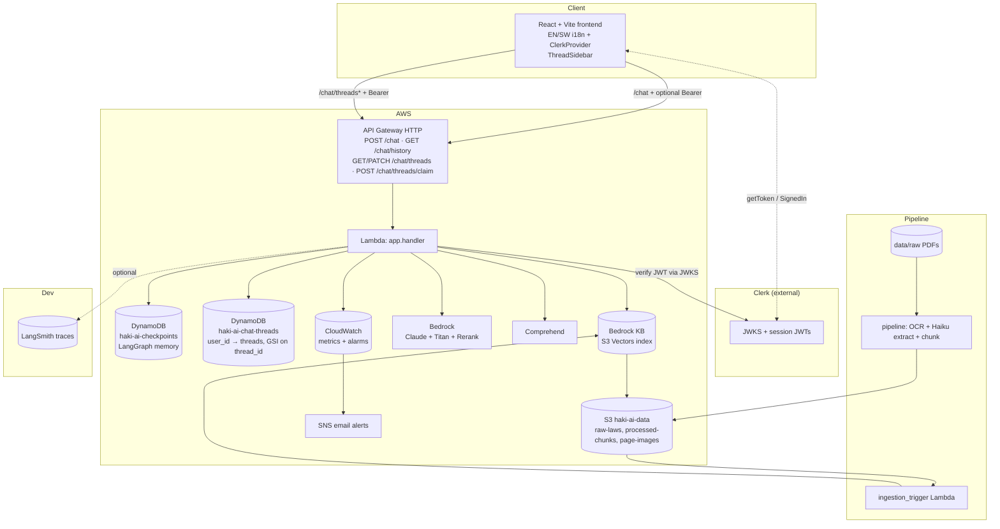
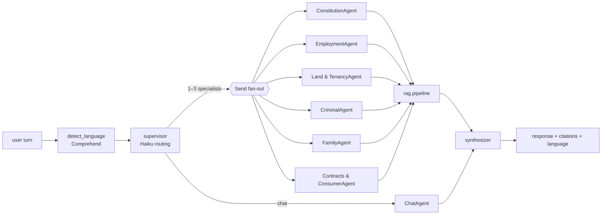

# Haki AI — Project Context

## What this is
A Kenyan legal-aid agent that answers questions about Kenyan law in
English and Swahili, with citations to specific Act, Chapter, and
Section. Built around a two-tier multi-agent LangGraph with an
advanced RAG pipeline (hybrid retrieval + rerank) over Bedrock Claude.

## Stack
- Frontend: React + Vite + Tailwind v4, full EN/SW i18n with auto
  language switch driven by the backend's Comprehend detection.
- Auth: **optional** Clerk sign-in via `@clerk/clerk-react`. Anonymous
  usage is the default; signing in unlocks per-user chat history, LLM-
  generated chat titles, and inline rename.
- Backend: Python 3.12 Lambda orchestrating a LangGraph StateGraph
  with DynamoDB checkpointing for multi-turn memory. Clerk JWT
  verification (PyJWT + JWKS, issuer auto-derived from the publishable
  key) gates the signed-in routes.
- RAG: pre-chunking pipeline (TypeScript + LiteParse OCR + Haiku
  extraction) → Bedrock KB over S3 Vectors → advanced-RAG pipeline
  (query expansion, hybrid BM25+dense, RRF, TOC filter, Cohere rerank).
- Data sources: Kenyan primary sources as committed PDFs, processed
  into chunks with a filterable `source` metadata key. The corpus
  covers the Constitution of Kenya 2010, the Employment Act 2007,
  the Land Act 2012 + Landlord and Tenant Act (Cap. 301), the Penal
  Code (Cap. 63) + Criminal Procedure Code (Cap. 75) + Sexual
  Offences Act 2006, the Marriage Act 2014 + Children Act 2022, and
  the Law of Contract Act + Consumer Protection Act 2012.
- Evaluation: RAGAS (faithfulness / answer_relevancy /
  context_precision / context_recall) + LLM-as-judge on 4 axes.
- IaC: Terraform modular. GitHub Actions for CI (unit + Playwright e2e),
  deploy, nightly evals.
- Observability: LangSmith per-turn tracing + CloudWatch metrics,
  alarms, dashboards, and SNS alerts.

## System architecture



## LangGraph agent flow



## Project layout
```
haki-ai/
├── frontend/
│   ├── src/
│   │   ├── api/               # chatClient.ts + threadsClient.ts
│   │   ├── components/        # ChatApp, ThreadSidebar, Composer, MessageThread, SourcePanel, …
│   │   ├── lib/               # I18nContext, AuthBridge, authedFetch
│   │   └── main.tsx           # ClerkProvider root
│   └── e2e/                   # Playwright POM + fixtures + specs + config
├── backend/
│   ├── app/                   # handler.py, graph.py, auth.py, config.py, server_local.py
│   ├── agents/                # supervisor, specialists, chat, synthesizer, classifier, title
│   ├── rag/                   # query_expansion, hybrid_retriever, bm25, rrf, filters, reranker, citations, generator
│   ├── clients/               # boto3 factory + ComprehendAdapter / BedrockRAGAdapter / LocalRAGAdapter
│   ├── memory/                # checkpointer.py (LangGraph) + threads.py (per-user index)
│   ├── observability/         # LangSmith tracing + CloudWatch metrics
│   ├── prompts/               # all LLM prompts incl. TITLE_GENERATOR_PROMPT
│   ├── evals/                 # golden_set.jsonl + RAGAS + llm_judge + report writer
│   └── tests/                 # unit + e2e
├── pipeline/                  # TypeScript: PDF → pages → chunks
├── data/raw/                  # committed Kenyan law PDFs
├── infra/
│   └── modules/
│       ├── storage/           # S3 + S3 Vectors index + checkpoints + chat_threads (with GSI)
│       ├── compute/           # Lambda + ingestion_trigger + CLERK_PUBLISHABLE_KEY env
│       ├── api/               # API Gateway HTTP (5 routes, PATCH in CORS)
│       ├── ai/                # Bedrock KB + Guardrails
│       ├── web/               # CloudFront + S3 static site
│       └── observability/     # alarms + dashboard + SNS
├── .github/workflows/         # ci.yml (backend + frontend + e2e), deploy.yml, eval-nightly.yml
└── scripts/                   # bootstrap.sh
```

## Per-package docs
Each backend package has its own diagram-led one-pager:

- [backend/app](backend/app/CLAUDE.md) — entry points (Lambda, local server, ingestion CLI)
- [backend/agents](backend/agents/CLAUDE.md) — supervisor + specialists + synthesizer
- [backend/rag](backend/rag/CLAUDE.md) — advanced RAG pipeline stages
- [backend/clients](backend/clients/CLAUDE.md) — boto3 factory + adapters
- [backend/memory](backend/memory/CLAUDE.md) — DynamoDB checkpointer
- [backend/observability](backend/observability/CLAUDE.md) — tracing + metrics
- [backend/prompts](backend/prompts/CLAUDE.md) — LLM prompt templates
- [backend/evals](backend/evals/CLAUDE.md) — RAGAS + LLM-judge harness
- [backend/tests](backend/tests/CLAUDE.md) — test suite

## Key architecture decisions

### Advanced RAG (Phase 1)
The single `retrieve_and_generate` call was split into a pipeline
(`rag/pipeline.py`) with: HyDE-style query expansion (3 variants),
dense retrieval via Bedrock KB + in-memory BM25 over `processed-chunks`,
Reciprocal Rank Fusion, TOC filter (chunks tagged `chunkType=toc` at
pipeline time are excluded), Cohere Rerank v3.5 on Bedrock, citation
dedup by `(source, section)`, then Claude `invoke_model` for generation.
`LocalRAGAdapter` runs the same pipeline against ChromaDB so dev/prod
parity holds.

### Two-tier multi-agent (Phase 2)
`SupervisorRouter` (Haiku, JSON) picks 1–3 specialists or `chat`.
Each specialist is a sub-agent that runs the advanced-RAG pipeline
scoped to a **legal domain** via a list-valued `source` filter
(Bedrock KB `in` clause in prod, Chroma `$in` locally) so a single
specialist can span every statute covering its area of law. Current
domains: `constitution`, `employment`, `land` (Land Act + Cap. 301),
`criminal` (Penal Code + CPC + Sexual Offences), `family` (Marriage
+ Children), `contracts` (Contract Act + Consumer Protection).
`Synthesizer` merges ≥2 specialist outputs; single-specialist turns
pass through verbatim. Fan-out uses LangGraph's `Send()` with a
per-turn-reset reducer on `specialist_outputs`.

### Evaluation harness (Phase 3)
30-question golden set, RAGAS (optional dep), LLM-as-judge on 4 axes,
markdown reports + `EvalScore` CloudWatch metric. CI blocks PRs on
eval-score regressions >5%.

### Problem-solution fit (Phase 4)
- Frontend i18n covers ~30 UI strings in EN + SW, auto-switches locale
  on detected Swahili responses, `manualLocaleOverride` persists user
  intent in `localStorage`.

### Deployment maturity (Phase 5)
- `make setup` bootstraps state bucket, copies `.env.example` → `.env`,
  installs backend/pipeline/frontend deps, and applies the local
  LocalStack infra — one command from a fresh clone.
- `ingestion_trigger` Lambda debounces S3 EventBridge events for
  `processed-chunks/` and calls `bedrock-agent.start_ingestion_job`
  — dropping a new Act PDF and running the pipeline re-indexes the KB
  with no human in the loop.
- `.github/workflows/ci.yml` (tests + evals on PR),
  `deploy.yml` (OIDC → terraform apply + deploy-web + ingest
  net-new PDFs), `eval-nightly.yml` (RAGAS report posted to main).

### Separation of concerns (Phase 6)
`backend/` is packaged by concern: `app/`, `agents/`, `rag/`,
`clients/`, `memory/`, `observability/`, `prompts/`, `evals/`,
`tests/`. Lambda ships only the runtime-relevant subset (tests, evals,
scripts, `*_local.py` excluded). Each package has its own
`CLAUDE.md` with a mermaid diagram.

### Optional auth + per-user chat history (Phase 7)

Anonymous usage is preserved as the default. Clerk sign-in is bolted
onto the existing stack along three independent axes: frontend
provider, backend verification, and dedicated storage.

- **No extra env var for issuer derivation.** The Clerk publishable
  key already encodes the Frontend API host; `backend/app/auth.py`
  base64-decodes it and constructs the JWKS URL at runtime. One
  canonical `VITE_CLERK_PUBLISHABLE_KEY` in the root `.env` feeds both
  `ClerkProvider` (via Vite's `define`) and the backend's JWT verifier.
- **Thread index is its own table**, not a new item type on the
  checkpoints table. `backend/memory/threads.py` stores
  `(user_id, thread_id, title, timestamps)` rows in `haki-ai-chat-threads`
  with a `KEYS_ONLY` GSI on `thread_id` so the ownership gate
  (`_thread_owner()`) is one RCU. Keeping it separate from
  `DynamoDBSaver` leaves the checkpoint schema untouched.
- **Ownership gate, not token gate, on `POST /chat` + `GET /chat/history`.**
  Both routes accept Bearer *optionally* — but if the `sessionId`
  they're called with is already owned by a different user in the
  GSI, the handler short-circuits with a `403`. The graph is never
  invoked and `load_history` is never called, so cross-user memory
  cannot leak even via guessed UUIDs.
- **Self-healing client**: `frontend/src/api/chatClient.ts` treats a
  `403` on `POST /chat` or `GET /chat/history` as "my persisted
  `sessionId` is stale" (the usual cause is signing out of an account
  that claimed the thread). It resets the local session id and retries
  once — so sign-out + hard refresh never leaves the UI broken.
- **Titles are advisory.** `backend/agents/title.py` runs a single
  cheap Haiku call on the first signed-in turn and writes a ≤6-word
  title. Any failure returns `"New chat"` and is logged — the title
  path can never fail the chat reply.

Data-flow contracts for the new routes:

```
POST /chat/threads/claim  { threadId }              → 200 { thread }
GET  /chat/threads                                   → 200 { threads: [...] }
PATCH /chat/threads       { threadId, title }        → 200 { thread } | 404 | 403
```

All three require a verified Clerk session JWT; a missing / invalid /
expired Bearer returns `401 { error: "Authentication required" }`.

## Chunk metadata sidecar (Bedrock KB native)
```json
{
  "metadataAttributes": {
    "source": "Employment Act 2007",
    "chapter": "Part III — Termination of Contract",
    "section": "Section 40",
    "title": "Termination of employment",
    "chunkId": "employment-act-2007-part-iii-section-40",
    "pageImageKey": "page-images/employment-act-2007/page-40.pdf",
    "chunkType": "body"
  }
}
```

`source` and `chunkType ∈ {"body", "toc"}` are filterable;
`chapter` / `title` / `pageImageKey` / `AMAZON_BEDROCK_TEXT` /
`AMAZON_BEDROCK_METADATA` are non-filterable to stay under the
2048-byte S3 Vectors filterable-metadata cap.

## Local testing strategy

### Paths
- **`make dev`** — LocalStack + ChromaDB + backend in-process
  (`python -m app.server_local`, port 8080) + Vite dev server.
  Real AWS creds for Bedrock; everything else against LocalStack.
- **LocalStack Lambda** — for infra/wiring verification only;
  Bedrock calls fail inside the Lambda container by design.

### Commands
- `make test` — `unittest discover -s tests -p 'test_unit.py'` (backend,
  264 tests in ~8 s) + `tsc --noEmit` (frontend) + `npm test` (pipeline).
- `npm run test:e2e` (from `frontend/`) — Playwright suite:
  5 anonymous specs always run; 5 signed-in specs skip unless
  `CLERK_SECRET_KEY` + `E2E_CLERK_USER_USERNAME` +
  `E2E_CLERK_USER_PASSWORD` are set.
- `make eval` — `uv run -m evals.run` against the golden set.
- `make ingest-local` — hydrate `.local-vectorstore/` from LocalStack S3.

## CloudWatch metrics (namespace: HakiAI)
- Request/response: `SuccessfulRequests`, `FailedRequests`,
  `ResponseLatency`.
- Language: `DetectedLanguage_english` / `_swahili` / `_mixed`.
- Quality: `GuardrailBlock`, `MissingCitations`,
  `LowConfidenceRetrieval`, `EvalScore`.

## Terraform state
- Remote backend: S3 bucket `haki-ai-terraform-state`.
- Workspaces: `default` → prod, `local` → LocalStack. Flip with
  `terraform workspace select`.
- Prod apply needs `TF_VAR_langsmith_api_key` (secret) and
  `TF_VAR_clerk_publishable_key` (GitHub Actions **variable**
  `VITE_CLERK_PUBLISHABLE_KEY` — it's browser-safe and reused by the
  Vite build step in the same workflow).

## Current status
Phase 1–7 of the rubric-alignment plan are complete: advanced RAG,
two-tier multi-agent, eval harness, Swahili UI, clone-and-run
Makefile, auto ingestion, three GitHub Actions workflows, backend
refactor, per-package diagram-led docs, and optional Clerk auth with
per-user thread history + ownership-gated signed-in routes. Remaining
work (custom Clerk domain for `pk_live_*`, API Gateway throttling,
mobile drawer, thread delete) is tracked in the README's
_Production readiness_ section.
