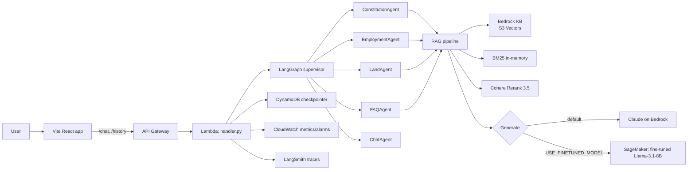

# Haki AI

A Kenyan legal-aid assistant powered by advanced RAG, a two-tier
multi-agent system, and a bilingual (English / Swahili) interface.

Haki AI answers questions about Kenyan statutes with Act, Chapter, and
Section citations, works in English or Kiswahili, and surfaces the exact
page of the source PDF alongside every answer.

## Quick start

```bash
# 1. Clone and bootstrap (installs deps, creates .env, applies local infra)
git clone <this repo> haki-ai && cd haki-ai
make setup

# 2. Add your LocalStack Pro + LangSmith keys to .env
$EDITOR .env

# 3. Run the pipeline once to OCR + chunk the statutes
cd pipeline && npm run dev && cd ..

# 4. Ingest the chunks into local ChromaDB
make ingest-local

# 5. Start the full local stack (LocalStack, backend, frontend)
make dev
```

The frontend is then served at http://localhost:5173 and the backend
server at http://localhost:3001.

## Make targets

| Target              | What it does                                                         |
| ------------------- | -------------------------------------------------------------------- |
| `make setup`        | One-shot: installs deps, creates `.env`, bootstraps Terraform state. |
| `make dev`          | Runs LocalStack + backend + frontend concurrently.                   |
| `make ingest-local` | Pulls processed chunks from LocalStack S3 into ChromaDB.             |
| `make test`         | Backend + pipeline + frontend type-check.                            |
| `make eval`         | Runs the 30-question golden-set evaluation (RAGAS + LLM-judge).      |
| `make clean`        | Clears caches and build artefacts.                                   |

## Project layout

```
haki-ai/
├── backend/       Python Lambda handler, LangGraph agents, RAG pipeline, evals
├── frontend/      Vite + React + Tailwind single-page app
├── pipeline/      Node.js statute ingestion pipeline (download → OCR → chunk → upload)
├── infra/         Terraform (S3, DynamoDB, Lambda, Bedrock KB, SageMaker, CloudFront)
├── scripts/       bootstrap.sh (state bucket), run-finetune.sh (SageMaker job)
└── CLAUDE.md      System-wide context for the AI assistant working on this repo
```

Each sub-project has its own `CLAUDE.md` / `README.md` with folder-level
detail. The top-level `CLAUDE.md` is the single source of truth for how
the pieces connect.

## Architecture at a glance



## Evaluation

Haki AI ships with a 30-question golden set that exercises every
supervisor route and includes Swahili + mixed-language cases. Run:

```bash
make eval
```

The evaluation harness writes a markdown report to
`backend/evals/reports/{timestamp}.md` and emits an `EvalScore`
CloudWatch metric so regressions surface on the HakiAI dashboard.

## Local vs. prod

Haki AI uses Terraform workspaces to isolate LocalStack (`local`) from
real AWS (`default`). Bedrock is never emulated — even the local path
hits real AWS for LLM / embedding / rerank calls.

See `infra/Makefile` for the `local-*` and prod targets and
`CLAUDE.md` for the full conversation history of why we made each
architectural choice.
