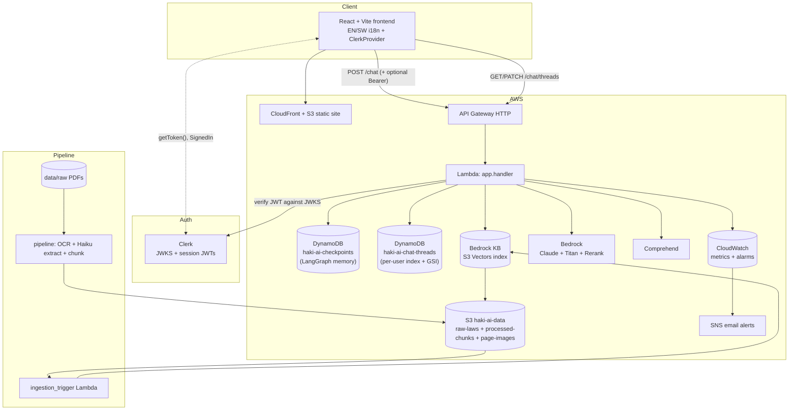
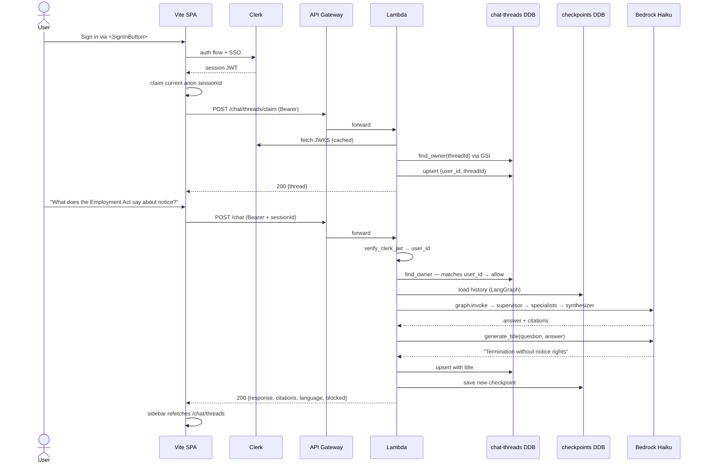
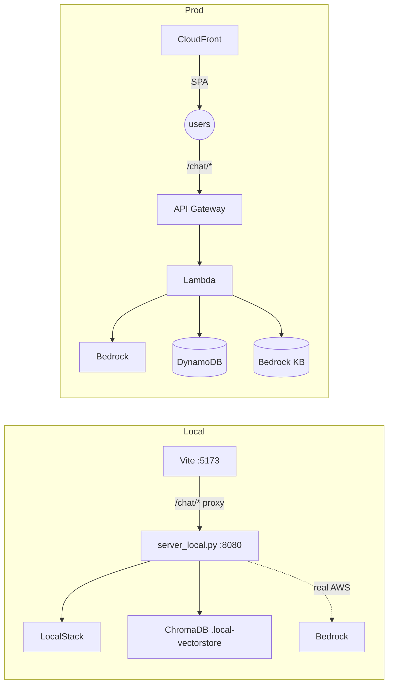

# Haki AI

A Kenyan legal-aid assistant powered by an advanced RAG pipeline, a
two-tier multi-agent LangGraph, and a bilingual (English / Swahili)
React interface.

Haki AI answers questions about Kenyan statutes with Act, Chapter, and
Section citations, works in English or Kiswahili, surfaces the exact
page of the source PDF alongside every answer, and — optionally —
keeps per-user chat history when the user signs in with Clerk.

**Live app:** <https://d35h3o273l67fs.cloudfront.net/>

<p align="center">
  <a href="https://d35h3o273l67fs.cloudfront.net/">
    
  </a>
</p>

## Table of contents

- [Quick start](#quick-start)
- [Architecture](#architecture-at-a-glance)
- [Authentication & chat history](#authentication--chat-history)
- [HTTP API surface](#http-api-surface)
- [Tests](#tests)
- [Make targets](#make-targets)
- [Project layout](#project-layout)
- [Evaluation](#evaluation)
- [Local vs. prod](#local-vs-prod)
- [Production readiness](#production-readiness)

## Quick start

```bash
# 1. Clone and bootstrap (installs deps, creates .env, applies LocalStack infra)
git clone <this repo> haki-ai && cd haki-ai
make setup

# 2. Fill in .env — LocalStack Pro token, LangSmith key, and the Clerk publishable key
#    (see "Authentication & chat history" below for what the Clerk key is and where to
#    get one. A pk_test_* key from a free Clerk dev instance works fine for local dev.)
$EDITOR .env

# 3. Run the pipeline once to OCR + chunk the statutes
cd pipeline && npm run dev && cd ..

# 4. Ingest the chunks into local ChromaDB
make ingest-local

# 5. Start the full local stack (LocalStack, backend, frontend)
make dev
```

- Frontend: http://localhost:5173
- Backend:  http://localhost:8080 (hand-rolled `http.server` that forwards every request to the Lambda handler in-process)
- LocalStack: http://localhost:4566

## Architecture at a glance



The LangGraph agent flow behind each `POST /chat` turn is unchanged by
the auth work and is documented in full in [CLAUDE.md](CLAUDE.md).

## Authentication & chat history

Authentication is **optional**. The app works anonymously out of the
box — signing in only unlocks persistent chat history in a sidebar,
LLM-generated chat titles, and the ability to rename those titles.

### Frontend wiring

- [`@clerk/clerk-react`](https://clerk.com/) with `<ClerkProvider>` at
  the root of `main.tsx`, reading `VITE_CLERK_PUBLISHABLE_KEY` (lives in
  `/.env` alongside the backend's Python-side secrets — the frontend's
  `vite.config.ts` loads env from both the repo root and `frontend/`
  and inlines `VITE_*` keys into the bundle; `process.env` wins in CI).
- `AuthBridge` registers Clerk's `getToken()` with a framework-free
  `authedFetch` helper so `src/api/*Client.ts` modules attach a Bearer
  header without importing any Clerk code.
- `ThreadSidebar` renders a collapsible left rail with "New chat",
  inline rename, and a Sign-in CTA. Disabled while a chat turn is
  streaming.

### Backend wiring

- [`backend/app/auth.py`](backend/app/auth.py) verifies Clerk session
  JWTs with PyJWT against a JWKS URL that is **auto-derived from the
  publishable key** (no extra env var to maintain). The publishable
  key's base64 body decodes to `<frontend-api-host>$`, so the issuer is
  `https://<host>` and the JWKS lives at
  `<issuer>/.well-known/jwks.json`. Keys are cached per `kid` for one
  hour.
- [`backend/memory/threads.py`](backend/memory/threads.py) stores
  `(user_id, thread_id, title, timestamps)` rows in a dedicated
  DynamoDB table (`haki-ai-chat-threads`) with a `KEYS_ONLY` GSI on
  `thread_id` so ownership lookups are O(1).
- [`backend/agents/title.py`](backend/agents/title.py) generates a
  ≤6-word title in the conversation's language the first time a
  signed-in user posts into a thread. Failures fall back to `"New chat"`
  so a title failure can never fail the chat reply.

### Flow — signed-in first turn



### Ownership gate

`POST /chat`, `GET /chat/history`, and `POST /chat/threads/claim` all
look up `thread_id` in the GSI before doing anything else. The rules:

- **Unowned thread** — any caller (anonymous or signed-in) may
  read/write. Anonymous UUIDs stay readable on the device that minted
  them.
- **Owned thread, caller is owner** — allow.
- **Owned thread, caller is anonymous or a different user** — **403**.
  The LangGraph graph is never invoked and `load_history` is never
  called, so no memory bytes leak across accounts.

When the frontend hits a 403 on `POST /chat` or `GET /chat/history` —
which happens after sign-out when the persisted `sessionId` still
points at the thread the signed-in user owned — `chatClient`
self-heals: it calls `resetChatSession()` to mint a fresh UUID and
retries the POST once. No user-visible error.

## HTTP API surface

| Method | Path                        | Auth         | Body / query                              | What it does                                                 |
| ------ | --------------------------- | ------------ | ----------------------------------------- | ------------------------------------------------------------ |
| POST   | `/chat`                     | optional     | `{message, sessionId}`                    | Runs a chat turn. Signed-in turns index the thread + title.  |
| GET    | `/chat/history`             | optional     | `?sessionId=…`                            | Rehydrates the persisted conversation.                       |
| GET    | `/chat/threads`             | **required** | —                                         | Lists the signed-in user's threads, newest first.            |
| PATCH  | `/chat/threads`             | **required** | `{threadId, title}`                       | Renames a thread the caller owns. 404 if missing, 403 if not the owner. |
| POST   | `/chat/threads/claim`       | **required** | `{threadId}`                              | Claims an anonymous session for the caller. Idempotent.      |

API Gateway v2 CORS lives in [`infra/modules/api/main.tf`](infra/modules/api/main.tf)
and allows `GET, POST, PATCH, OPTIONS`. Origins are `*` today — should
be locked to the CloudFront / custom domain before public launch (see
[Production readiness](#production-readiness)).

## Tests

### Backend

```bash
cd backend && uv run python -m unittest discover -s tests -p 'test_unit.py'
```

264 tests, runs in ~8 s, no AWS creds required. Coverage highlights:

- Clerk JWT verify happy / expired / wrong-issuer / missing-sub / garbage
- `extract_bearer` across API Gateway v2 and hand-rolled event shapes
- `ThreadsRepo` CRUD + `find_owner` via the GSI
- Title sanitisation + LLM-failure fallback
- 12 handler scenarios: auth required / optional, ownership gate on
  all three signed-in routes, anonymous-on-owned rejection, claim
  idempotence

### Frontend E2E (Playwright)

```bash
cd frontend && npm run test:e2e
```

Specs live under [`frontend/e2e/`](frontend/e2e/) with POM + fixtures:

- **5 anonymous specs** — always run, hermetic (Vite mock mode + `page.route()` intercepts `/chat/threads*`).
- **5 signed-in specs** — exercise the real `@clerk/testing` flow; skip gracefully when `CLERK_SECRET_KEY` / `E2E_CLERK_USER_USERNAME` / `E2E_CLERK_USER_PASSWORD` aren't set.

Playwright config is at [`frontend/e2e/playwright.config.ts`](frontend/e2e/playwright.config.ts); CI wires the job in [`.github/workflows/ci.yml`](.github/workflows/ci.yml) with browser cache + trace/video artefacts on failure.

### Smoke-test the full local stack

```bash
curl -s -X POST http://localhost:8080/chat \
  -H 'Content-Type: application/json' \
  -d '{"message":"What does the Constitution say about equality?","sessionId":"dev"}' | jq .response

curl -s http://localhost:8080/chat/threads   # expect 401 (signed-in only)
```

## Make targets

| Target              | What it does                                                         |
| ------------------- | -------------------------------------------------------------------- |
| `make setup`        | One-shot: installs deps, creates `.env`, bootstraps Terraform state. |
| `make dev`          | Runs LocalStack + backend + frontend concurrently.                   |
| `make ingest-local` | Pulls processed chunks from LocalStack S3 into ChromaDB.             |
| `make test`         | Backend unit tests + frontend type-check + pipeline tests.           |
| `make eval`         | Runs the 30-question golden-set evaluation (RAGAS + LLM-judge).      |
| `make clean`        | Clears caches and build artefacts.                                   |

## Project layout

```
haki-ai/
├── backend/
│   ├── app/               # handler.py, graph.py, auth.py, config.py, server_local.py
│   ├── agents/            # supervisor, specialists, chat, synthesizer, classifier, title
│   ├── rag/               # query_expansion, hybrid_retriever, bm25, rrf, filters, reranker, citations, generator
│   ├── clients/           # boto3 factory + ComprehendAdapter / BedrockRAGAdapter / LocalRAGAdapter
│   ├── memory/            # checkpointer.py (LangGraph) + threads.py (per-user index)
│   ├── observability/     # LangSmith tracing + CloudWatch metrics
│   ├── prompts/           # all LLM prompts (incl. TITLE_GENERATOR_PROMPT)
│   ├── evals/             # golden_set.jsonl + RAGAS + llm_judge + report writer
│   └── tests/             # unit + e2e
├── frontend/
│   ├── src/
│   │   ├── api/           # chatClient.ts, threadsClient.ts
│   │   ├── components/    # ChatApp, ThreadSidebar, Composer, MessageThread, ...
│   │   ├── lib/           # I18nContext, AuthBridge, authedFetch
│   │   └── main.tsx       # ClerkProvider root
│   └── e2e/               # Playwright POM + specs + fixtures + config
├── pipeline/              # TypeScript: PDF → pages → chunks
├── data/raw/              # committed Kenyan law PDFs
├── infra/
│   └── modules/
│       ├── storage/       # S3 + S3 Vectors index + chat_threads table
│       ├── compute/       # Lambda + checkpoints DDB + ingestion_trigger
│       ├── api/           # API Gateway HTTP (5 routes, CORS)
│       ├── ai/            # Bedrock KB + Guardrails
│       ├── web/           # CloudFront + S3 static site
│       └── observability/ # alarms + dashboard + SNS
├── .github/workflows/     # ci.yml (tests + e2e), deploy.yml, eval-nightly.yml
├── CLAUDE.md              # system-wide context for AI assistants
└── scripts/               # bootstrap.sh
```

Every backend package has its own diagram-led `CLAUDE.md`. Top-level
[`CLAUDE.md`](CLAUDE.md) is the canonical system-wide map.

## Evaluation

Haki AI ships with a 30-question golden set that exercises every
supervisor route and includes Swahili + mixed-language cases:

```bash
make eval
```

Reports land in `backend/evals/reports/{timestamp}.md` and the
`EvalScore` CloudWatch metric surfaces regressions on the HakiAI
dashboard. CI blocks PRs on eval regressions > 5 %.

## Local vs. prod

Haki AI uses Terraform workspaces to isolate LocalStack (`local`) from
real AWS (`default`). Bedrock is never emulated — even the local path
hits real AWS for LLM / embedding / rerank calls.



See [`infra/Makefile`](infra/Makefile) for the `local-*` and prod
targets, and [`CLAUDE.md`](CLAUDE.md) for the full conversation history
behind each architectural choice.

## Production readiness

The auth + threads work shipped in the `feat(auth)` / `fix(auth)` /
`fix(deploy)` commit trio is feature-complete, but a handful of items
should happen before a real public launch:

- **Custom Clerk domain**: `pk_live_*` requires a domain you control
  (CloudFront's `*.cloudfront.net` can't host Clerk CNAMEs). Register
  a domain, add the `clerk.*` / `accounts.*` / email CNAMEs in Route
  53, verify in the Clerk dashboard.
- **Lock CORS** from `["*"]` to the production origin.
- **API Gateway throttling** on the signed-in routes to prevent
  `thread_id` enumeration abuse.
- **Mobile drawer**: the sidebar is `hidden lg:flex`; phones get no
  thread history today.
- **Thread delete** endpoint + UI.
- **Log retention**: API Gateway access logs are 7 days; bump to
  30–90 for prod.
- Full list + rationale is in the commit description for
  `feat(auth): add optional Clerk auth with per-user chat history` and
  mirrored below each affected package's `CLAUDE.md`.
