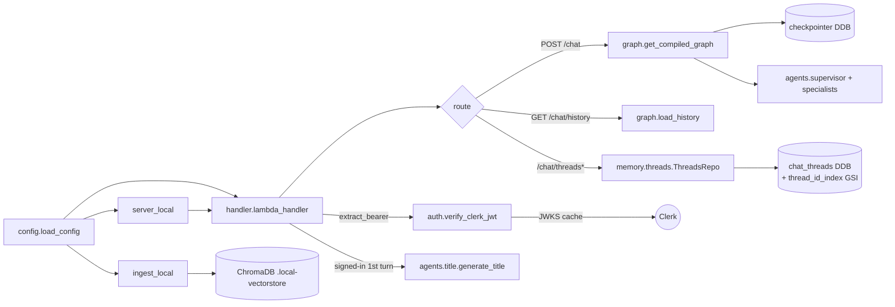

# backend/app — Application entry points

## Purpose
Thin application layer that wires config, clients, and the LangGraph
orchestrator into the three runtime surfaces: Lambda (prod), local HTTP
server (frontend dev), and local ingestion CLI. Also owns Clerk session
JWT verification — the sole place where the publishable-key-derived
issuer + JWKS lookup lives.

## Files
- `config.py` — `load_config()` reads env vars once; returns a frozen
  `Config` dataclass used everywhere. Picks up `CLERK_PUBLISHABLE_KEY`
  (falls back to `VITE_CLERK_PUBLISHABLE_KEY`) so the same root `.env`
  powers both the frontend bundle and the backend's JWT verifier.
- `auth.py` — **Clerk JWT verification**. `derive_issuer()` decodes the
  publishable key to the Frontend API host; `verify_clerk_jwt(token,
  pub_key)` fetches + caches the JWKS at `<issuer>/.well-known/jwks.json`
  (keyed by `kid`), validates RS256 signature + `iss` + `exp` + `sub`,
  and returns the Clerk user id or `None`. Never raises — callers treat
  every failure as "anonymous".
- `graph.py` — LangGraph `StateGraph` definition: `detect_language →
  supervisor → Send() to specialists → synthesizer → END`. Uses
  `DynamoDBSaver` checkpointer for multi-turn memory.
- `handler.py` — Lambda entry point + router for five routes:
  - `POST /chat` — runs the graph; optional Bearer auth. When signed
    in, the handler upserts a row in the thread index on every turn
    (preserving any user-edited title) and generates a title on the
    first turn for the `(user_id, session_id)` pair. The ownership
    gate rejects `sessionId`s owned by another user with `403`.
  - `GET /chat/history` — rehydrates the persisted conversation; same
    ownership gate.
  - `GET /chat/threads` — lists the signed-in user's threads (401 if
    unauthenticated).
  - `PATCH /chat/threads` — rename `{threadId, title}`; 404 if the
    thread doesn't exist, 403 if it isn't the caller's.
  - `POST /chat/threads/claim` — attaches an anonymous `sessionId` to
    the now-signed-in user. Idempotent; 403 when the thread is owned
    by a different user.
- `server_local.py` — minimal `http.server` on port 8080 that forwards
  every method (`GET/POST/PATCH/DELETE/OPTIONS`) to `lambda_handler`
  with an API-Gateway-v2-shaped event. Loads the repo-root `.env` so
  Clerk JWT verification works out of the box in `make dev`.
- `ingest_local.py` — one-shot CLI that hydrates `.local-vectorstore/`
  by reading `processed-chunks/*.txt` + sidecar JSON from LocalStack S3
  and writing them to ChromaDB via Titan embeddings.

## Internal data flow

## Conventions
- No business logic lives here — only env parsing, HTTP/Lambda
  plumbing, routing, and graph invocation.
- Every entry point loads config once at module import and passes the
  resulting `Config` object downstream; never read `os.environ`
  directly in this package outside `config.py`.
- `_thread_owner()` fails open (treat as unowned) on any DDB error so
  an ownership-index outage cannot harden the chat path into a
  brownout — anonymous threads already had no owner, so the worst
  case matches pre-auth behaviour.
- JWT verification is never in the chat hot path's critical latency
  window: JWKS is cached per `kid`, and the verifier short-circuits
  on missing keys.
