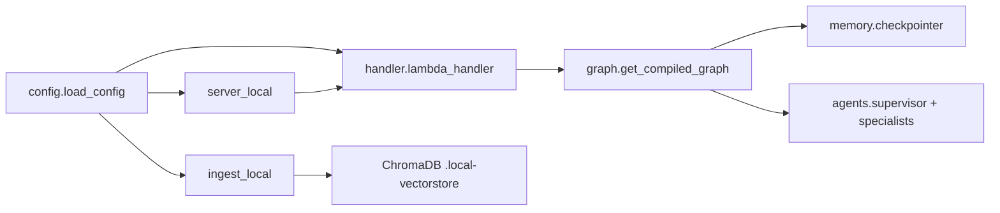

# backend/app — Application entry points

## Purpose
Thin application layer that wires config, clients, and the LangGraph
orchestrator into the three runtime surfaces: Lambda (prod), local HTTP
server (frontend dev), and local ingestion CLI.

## Files
- `config.py` — `load_config()` reads env vars once; returns a frozen
  `Config` dataclass used everywhere.
- `graph.py` — LangGraph `StateGraph` definition: `detect_language →
  supervisor → Send() to specialists → synthesizer → END`. Uses
  `DynamoDBSaver` checkpointer for multi-turn memory.
- `handler.py` — Lambda entry point. Parses `{message, sessionId}`,
  loads history from the checkpointer, invokes the compiled graph with
  `thread_id=sessionId`, emits CloudWatch metrics, and returns
  `{response, citations, language, blocked, sessionId}`. Lambda runtime
  handler path: `app.handler.lambda_handler`.
- `server_local.py` — minimal `http.server` on port 8080; frontend dev
  uses this via the Vite proxy. Skips IAM and runs the same handler
  in-process.
- `ingest_local.py` — one-shot CLI that hydrates `.local-vectorstore/`
  by reading `processed-chunks/*.txt` + sidecar JSON from LocalStack S3
  and writing them to ChromaDB via Titan embeddings.

## Internal data flow

## Conventions
- No business logic lives here — only env parsing, HTTP/Lambda
  plumbing, and graph invocation.
- Every entry point loads config once at module import and passes the
  resulting `Config` object downstream; never read `os.environ`
  directly in this package outside `config.py`.
