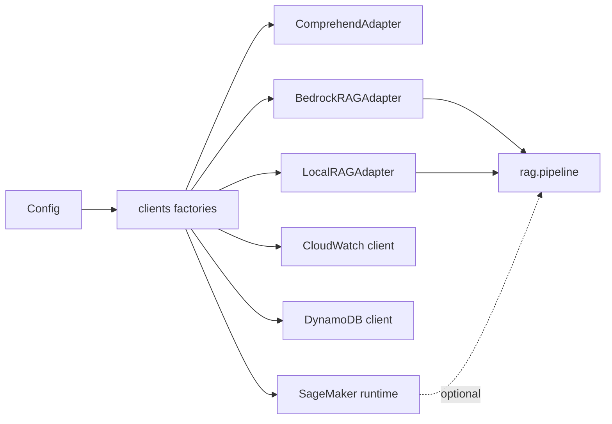

# backend/clients — boto3 factory + RAG adapters

## Purpose
Single source of truth for constructing AWS SDK clients, and the
adapter layer that smooths over the differences between production
(Bedrock + Bedrock KB + S3 Vectors) and local (ChromaDB + LocalStack).
Business logic elsewhere never calls `boto3.client(...)` directly.

## Files
- `__init__.py` — `make_comprehend`, `make_bedrock_runtime`,
  `make_bedrock_agent_runtime`, `make_cloudwatch`, `make_dynamodb_*`,
  `make_ssm`, `make_s3`, `make_sagemaker_runtime`. Each honours
  `ENV=local` to route through LocalStack.
- `adapters.py` — wraps raw clients with a friendlier interface:
  - `ComprehendAdapter` — language detection; falls back to `english`
    if Comprehend is unavailable (LocalStack).
  - `BedrockRAGAdapter` — prod retrieval: Bedrock KB `retrieve` +
    `rag.pipeline.run_pipeline` on top. Holds optional SageMaker
    client + flag to route generation to the fine-tuned endpoint.
  - `LocalRAGAdapter` — dev retrieval: ChromaDB (HTTP or in-process)
    returns Bedrock-KB-shaped results so the pipeline is identical.

## Internal data flow

## Conventions
- Adding a new AWS service: add `make_X` here and, if LocalStack
  differs, add an `XAdapter`. Graph/agents receive adapters, not raw
  clients, so future infra swaps stay local to this package.
- `BedrockRAGAdapter` and `LocalRAGAdapter` both expose the same
  `retrieve()` / `generate()` surface so `rag.pipeline` is
  adapter-agnostic.
