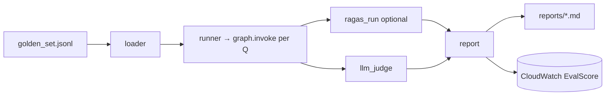

# backend/evals — RAG evaluation harness

## Purpose
Phase 3 deliverable: a quantitative "did we improve the system" story
for the bootcamp rubric. Runs RAGAS + LLM-as-judge against a 30-item
golden set and writes a markdown report to `evals/reports/`. Also
emits a single `EvalScore` CloudWatch metric so regressions surface
on the main dashboard.

## Files
- `golden_set.jsonl` — 30 curated Q&A pairs (10 Constitution, 10
  Employment, 10 Land; ≥10 are Swahili / mixed). Each entry:
  `{question, reference_answer, expected_sources, language}`.
- `loader.py` — parses the golden set and validates each record.
- `runner.py` — invokes the compiled graph against every question
  and captures `{answer, citations, retrieved_contexts, language}`.
- `ragas_run.py` — optional RAGAS metrics: `faithfulness`,
  `answer_relevancy`, `context_precision`, `context_recall`. Uses
  Claude on Bedrock as the judge LLM. Skipped cleanly if `ragas` is
  not installed.
- `llm_judge.py` — LLM-as-judge scoring on 4 axes (accuracy,
  citation correctness, tone, language appropriateness), 0–5 each.
- `report.py` — writes `reports/{timestamp}.md` with the summary
  table + per-question diffs. Pushes `EvalScore` to CloudWatch.
- `run.py` — CLI entry: `uv run -m evals.run` (invoked by
  `make eval` locally and `eval-nightly.yml` in CI).

## Internal data flow

## Conventions
- Never imports from `app.handler` — goes directly through the
  compiled LangGraph so evals reflect the agent, not the HTTP shim.
- Report paths include a timestamp so nightly runs don't clobber
  each other.
