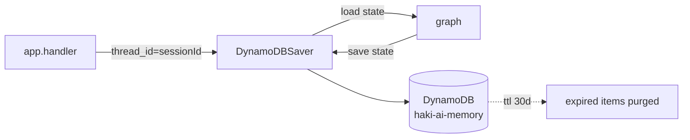

# backend/memory — Persistent agent memory

## Purpose
Persists LangGraph state (`messages`, `kb_session_id`, detected
language) across Lambda cold starts and `server_local.py` restarts so
multi-turn conversations survive infrastructure churn.

## Files
- `checkpointer.py` — `DynamoDBSaver` implementation of LangGraph's
  `BaseCheckpointSaver`. Keyed by `thread_id = sessionId`. TTL on
  `expires_at` auto-purges abandoned sessions after 30 days.

## Internal data flow

## Conventions
- Never write checkpoint data from business-logic code directly —
  always go through the graph so reducers run correctly.
- DynamoDB table is created in `infra/modules/compute`; this package
  only talks to it via boto3 (through `clients.make_dynamodb_*`).
