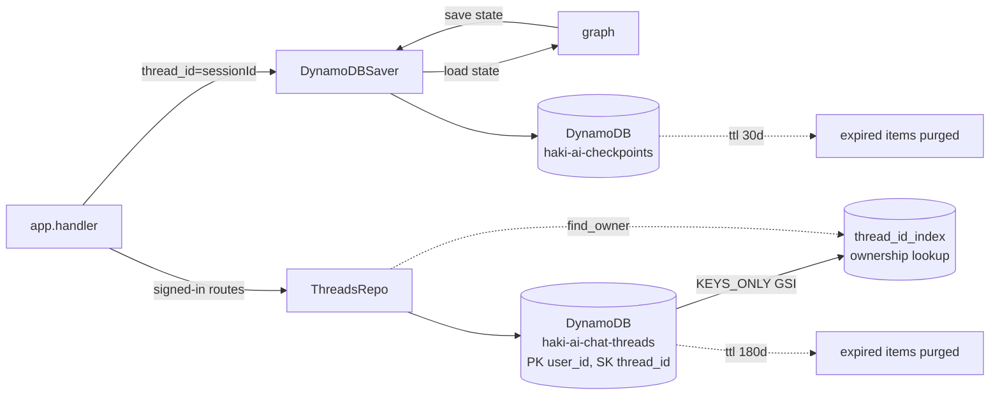

# backend/memory — Persistent memory

## Purpose
Persists two independent kinds of state:
1. **Conversation memory** via LangGraph's `DynamoDBSaver` —
   `messages`, `kb_session_id`, detected language. Keyed by
   `thread_id = sessionId` so multi-turn chats survive Lambda cold
   starts and `server_local.py` restarts.
2. **Per-user thread index** via `ThreadsRepo` — a thin catalogue of
   `(user_id, thread_id, title, timestamps)` that powers the
   "your chats" sidebar for signed-in users and the ownership gate on
   `/chat`, `/chat/history`, and the claim endpoint.

The two tables are deliberately independent: the checkpointer schema
stays completely unaware of users, and the thread index never touches
raw message payloads. Adding or removing auth could be done without
changing `DynamoDBSaver`.

## Files
- `checkpointer.py` — `DynamoDBSaver` implementation of LangGraph's
  `BaseCheckpointSaver`. Keyed by `thread_id = sessionId`. TTL on
  `expires_at` auto-purges abandoned sessions after 30 days.
  Table: `haki-ai-checkpoints`.
- `threads.py` — `ThreadsRepo` with four operations used by the
  handler:
  - `get(user_id, thread_id)` — fetch a single row.
  - `list_for_user(user_id)` — sidebar list, sorted by `updated_at` desc.
  - `find_owner(thread_id)` — O(1) lookup via the `thread_id_index`
    GSI (`KEYS_ONLY` projection); returns the owning `user_id` or
    `None`. Used by the handler's ownership gate.
  - `upsert(user_id, thread_id, *, title=None)` — create on first
    sight; on subsequent calls only bumps `updated_at`, preserving any
    user-edited title unless `title` is explicitly passed.
  - `update_title(user_id, thread_id, title)` — rename. No-op / `None`
    return if the row doesn't exist.
  Table: `haki-ai-chat-threads`. 180-day TTL on `expires_at`.

## Internal data flow

## Conventions
- Never write checkpoint data from business-logic code directly —
  always go through the graph so reducers run correctly.
- Never read/write `chat_threads` outside `ThreadsRepo` — the ownership
  semantics (`find_owner`, title preservation on upsert) belong here,
  not scattered across the handler.
- Both DynamoDB tables are created in `infra/modules/storage`; this
  package only talks to them via boto3 (through
  `clients.make_dynamodb_table`).
- TTL attribute is always named `expires_at` across both tables so the
  Terraform TTL config is uniform.
