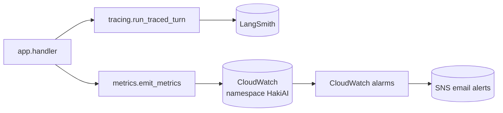

# backend/observability — Tracing + metrics

## Purpose
Two orthogonal concerns bundled together: LangSmith per-turn tracing
(for debugging agent runs) and CloudWatch custom metrics (for
dashboards + alarms). Both are best-effort — a failure here never
breaks the request path.

## Files
- `tracing.py` — `bootstrap_langsmith(config)` fetches the LangSmith
  API key from SSM Parameter Store once per cold start; on failure
  disables tracing cleanly. `run_traced_turn(...)` wraps a graph
  invocation with `metadata={session_id, language, needs_rag, ...}`.
- `metrics.py` — `emit_metrics(...)` publishes custom metrics to the
  `HakiAI` namespace: `SuccessfulRequests`, `FailedRequests`,
  `ResponseLatency`, `DetectedLanguage_*`, `GuardrailBlock`,
  `MissingCitations`, `LowConfidenceRetrieval`, and the
  `EvalScore` metric from the Phase 3 eval harness.

## Internal data flow

## Conventions
- All observability calls are wrapped in try/except — this package
  never raises into the request path.
- Metric names are stable: dashboards and alarms in
  `infra/modules/observability` assume them verbatim.
