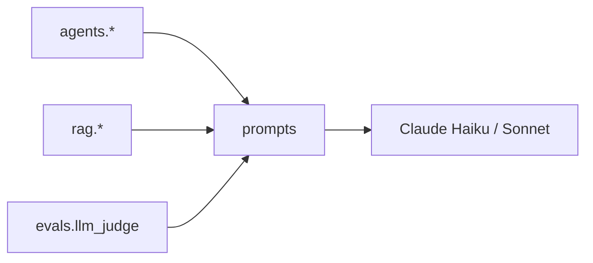

# backend/prompts — Centralised prompt templates

## Purpose
Every LLM call in the backend pulls its system/user prompt from this
package. Keeping them here makes prompt changes reviewable and
regression-testable via the Phase 3 eval harness, and guarantees the
bilingual refusal string stays consistent across surfaces.

## Files
- `__init__.py` — exposes:
  - `BILINGUAL_REFUSAL` — shared refusal string used by the guardrail
    path and by the system prompt.
  - `build_system_prompt(language)` — english / swahili / mixed
    variants for the RAG generator.
  - Prompts for the supervisor router, query expander, synthesizer,
    chat agent, classifier, and the LLM-as-judge scorer.

## Internal data flow

## Conventions
- Prompts are plain strings / small builder functions — no side
  effects, no AWS calls. Pure so they're cheap to unit-test.
- New prompts go in this one module; split into submodules only once
  it grows past ~300 lines.
