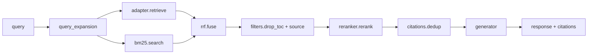

# backend/rag — Advanced RAG pipeline

## Purpose
Phase 1 advanced-RAG stack: query expansion → hybrid retrieve → TOC
filter → RRF fusion → Cohere rerank → citation dedup → generate.
Both `BedrockRAGAdapter` (prod) and `LocalRAGAdapter` (dev) call into
this pipeline so dev/prod retrieval behaviour stays identical.

## Files
- `pipeline.py` — top-level `run_pipeline(query, adapter, filters)`
  entry point. Composes every stage and returns a Bedrock-KB-shaped
  response dict so citation extraction downstream is unchanged.
- `query_expansion.py` — Haiku rewrites the user query into three
  variants: original, HyDE hypothetical answer, decomposed
  sub-question. Runs variants in parallel; falls back to original on
  Bedrock error.
- `hybrid_retriever.py` / `bm25.py` — dense (Bedrock KB `retrieve` or
  local Chroma via adapter) + sparse (`rank_bm25` in-memory index
  built once at cold start from `processed-chunks/*.txt`) retrieval.
- `rrf.py` — Reciprocal Rank Fusion over all 2×N result lists.
- `filters.py` — drops chunks where `chunkType=toc` (tagged in the
  pipeline step) and enforces any per-specialist `source` filter.
- `reranker.py` — Bedrock `rerank` with `cohere.rerank-v3-5:0`; top-20
  → top-5. Falls back to the un-reranked list if Bedrock fails.
- `citations.py` — extracts and dedups citations by `(source, section)`
  so segmented chunks don't produce duplicate references.
- `generator.py` — Claude `invoke_model` with assembled context
  window; enforces bilingual refusal on out-of-scope answers.
- `catalog.py` — cached list of all chunk IDs + metadata used to warm
  the BM25 index.

## Internal data flow

## Conventions
- Every stage is pure and takes the previous stage's output — easy to
  unit-test individually.
- Graceful degradation: every external call has a safe fallback path,
  never a hard failure that breaks the chat turn.
