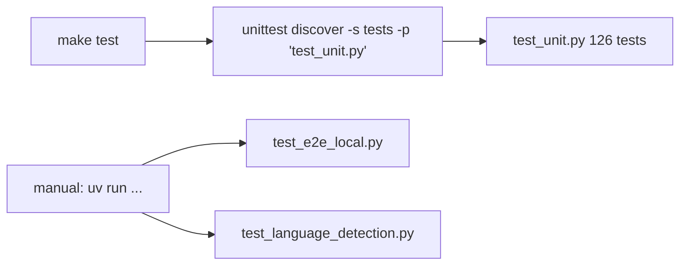

# backend/tests — Backend test suite

## Purpose
All Python tests for the backend. Unit tests run in ~20ms with no
AWS dependency; e2e and language-detection scripts hit real Bedrock /
LocalStack and are opt-in.

## Files
- `test_unit.py` — 126 unit tests covering classifier, supervisor
  parsing, RAG pipeline stages (query expansion, RRF, rerank,
  filters, citations), SageMaker generator fallback, synthesizer,
  LangSmith bootstrap, and the Lambda handler against a stubbed
  compiled graph.
- `test_e2e_local.py` — in-process end-to-end RAG against the local
  ChromaDB + real Bedrock. Requires `.local-vectorstore/` hydrated
  via `make ingest-local`.
- `test_language_detection.py` — CLI-style runner for AWS Comprehend;
  `--mock` flag runs it offline.

## How to run

- CI (`.github/workflows/ci.yml`) runs only `test_unit.py` — no AWS
  credentials required.
- E2E + language-detection scripts live here for convenience but are
  invoked by the developer, not the test runner.

## Conventions
- Every test file starts with `sys.path.insert(0, os.path.dirname(
  os.path.dirname(os.path.abspath(__file__))))` so imports like
  `from app.config import load_config` resolve from the backend
  package root.
- Unit tests must be side-effect-free — no network calls, no real
  boto3 clients. Use the fakes in `test_unit.py` as a reference.
