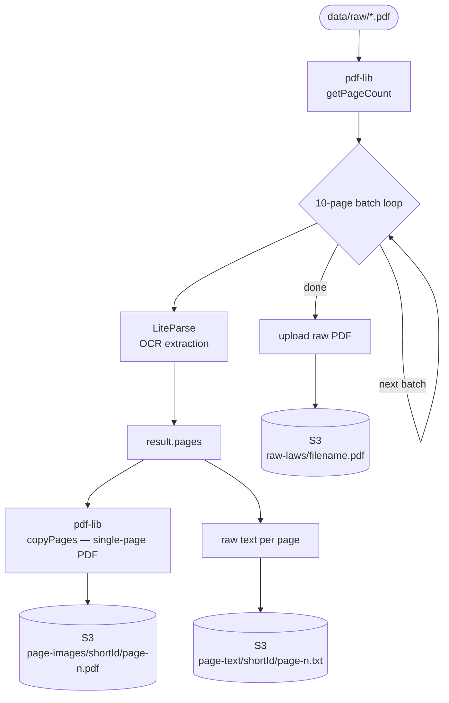
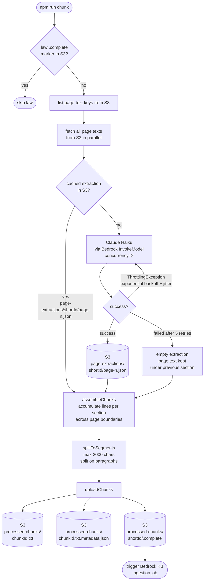

# Haki AI — PDF Pipeline

Two scripts that turn raw Kenyan law PDFs into Bedrock Knowledge Base chunks.

## Run order

```bash
npm run dev    # Script 1 — extract pages
npm run chunk  # Script 2 — LLM chunking
```

Then trigger a Bedrock KB ingestion job to embed and index.

---

## Script 1 — Page extraction (`src/run.ts`)



---

## Script 2 — LLM-assisted chunking (`src/chunk-laws.ts`)



---

## S3 layout

| Prefix | Contents | Written by |
|--------|----------|------------|
| `raw-laws/` | Original law PDFs | `run.ts` |
| `page-images/` | Single-page PDFs — used in citation carousel | `run.ts` |
| `page-text/` | Raw OCR text per page — input to chunking | `run.ts` |
| `page-extractions/` | Cached Haiku JSON — enables resume after throttle | `chunk-laws.ts` |
| `processed-chunks/` | `.txt` + `.txt.metadata.json` pairs for Bedrock KB | `chunk-laws.ts` |

---

## Chunk metadata sidecar

Each chunk gets a `.txt.metadata.json` sidecar in Bedrock KB native format:

```json
{
  "metadataAttributes": {
    "source":       "Employment Act 2007",
    "chapter":      "Part III — Termination of Contract",
    "section":      "Section 40",
    "title":        "Termination of employment",
    "chunkId":      "employment-act-2007-part-iii-section-40",
    "pageImageKey": "page-images/employment-act-2007/page-40.pdf"
  }
}
```

`pageImageKey` is used by the frontend citation carousel to render the source page.

---

## Re-processing a law

```bash
LAW=constitution-2010

# Remove completion marker and chunks
aws s3 rm s3://haki-ai-data/processed-chunks/${LAW}/.complete
aws s3 rm s3://haki-ai-data/processed-chunks/ --recursive \
  --exclude "*" --include "${LAW}-*"

# Remove cached Haiku extractions (only needed to force re-extraction)
aws s3 rm s3://haki-ai-data/page-extractions/${LAW}/ --recursive
```
